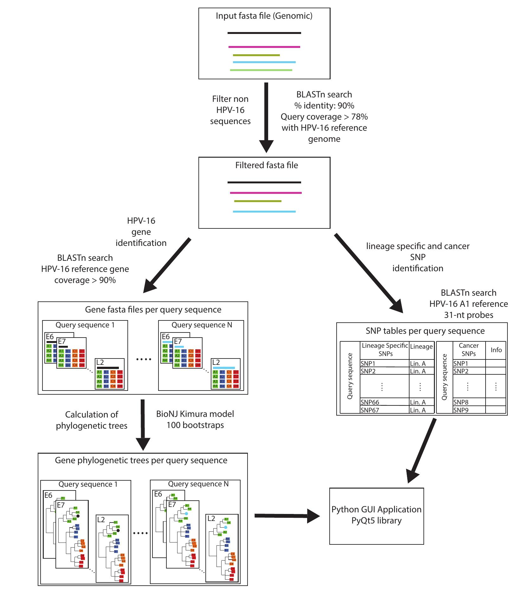
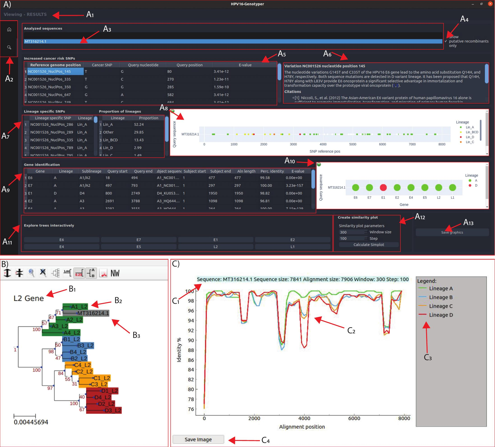

# HPV16-Genotyper: A Computational Tool for Risk-Assessment, Lineage Genotyping and Recombination Detection in HPV16 Sequences, Based on a Large-Scale Evolutionary Analysis

HPV16-Genotyper is a computational tool developed in 
Python that automates the entire process described in our <a href="#publication"> publication </a>  and performs genotyping, quality control of genome assembly, detection of recombination events and detection of cancer-related SNPs. The software was tested on 180 representative genomes and was validated for proper performance. The entire analysis took <b><u>16 min</u></b> on a personal Linux
laptop with eight cores (2.4 GHz)

A summary of the workflow is shown in <b>Figure 1</b>.
<a href="#image-1">Figure 2</a> shows an example of the phylogenetic and recombination analysis of the HPV16 strain with accession number
<a href="https://www.ncbi.nlm.nih.gov/nuccore/MT316214">MT316214.1</a> is described in detail the HPV16-Genotyper tool.

## Publication
The research paper was published in 2021 and can be found [here](https://doi.org/10.3390/d13100497).

## Pictures

***Figure 1.** A workflow of the HPV16-genotyper tool.*

<i><b>Figure 2.</b> The HPV16-Genotyper tool has three GUI components (A-C). The first component is the main results page. A1 is the status bar, where the user obtains information about the currently displayed page. A2 are the total pages available (Home and Results). The first frame of the results page contains A3, a list of all the analyzed sequences. By double clicking the name of one sequence, the page updates with the corresponding ifnormation. By checking the button A4, the list displays only the putative recombinants identified in the analysis. The next frame contains information about 9 SNPs associated with an increased risk of cancer (A5) and click on any of the identified SNPs displays information (A6) about that specific SNP. A7 shows the lineage-specific SNPs identified in the selected sequence and this information is summarized in graph A8. BLAST results for each gene are shown in table A9 and summarized in graph A10. In the frame A11, the user has the option to view the phylogenetic tree for each gene. In case the selected sequence does not contain the selected gene, an error message will be displayed. The A12 frame gives the option to create the similarity plot of the selected sequence. A13 saves A8 and A10 on the output directory. Panel B shows an example interactive tree visualization (made with <a href="https://github.com/etetoolkit/ete">ETE3</a>) where B1 is the gene label, B2 shows the different reference sequences which are colored based on their lineage and B3 shows the selected sequence which will always be colored gray. Panel C shows an example similarity plot window. C1 is the plot description, C2 is the similarity plot, C3 is the plot legend and C4 is a button that can save the page in JPG format. </i>

## Installing

The software is precompiled and ready to use for [Windows 10](http://bioinf.bio.uth.gr/downloads/HPV16-genotyperWin10.zip) and [Ubuntu 20](http://bioinf.bio.uth.gr/downloads/HPV16-genotyperUb20.tar.gz).
More information and a help video can be found on our laboratory's [website](http://bioinf.bio.uth.gr)  "Tools" section.

### Requirements

* #### Windows

  No requirements

* #### Ubuntu

  The application needs the libflt1.3 library, which can be installed via:
  1. `sudo apt-get install libfltk1.3*`
  or
  2. running the script <u>runHPV16genotyper</u>, found inside the        installation folder, with parameter **-i** (Needs sudo priviledge)
