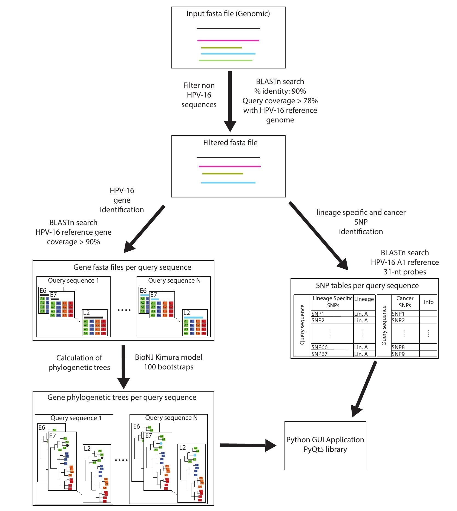
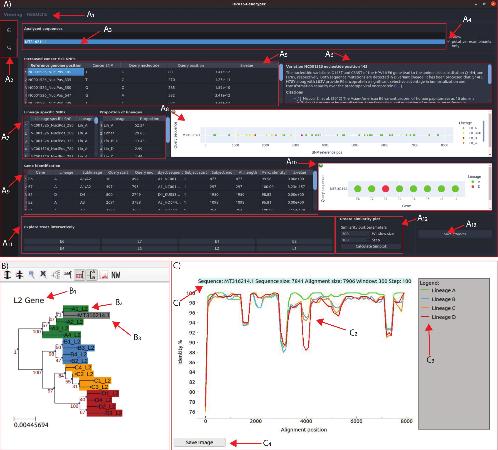

# HPV16-Genotyper: A Computational Tool for Risk-Assessment, Lineage Genotyping and Recombination Detection in HPV16 Sequences, Based on a Large-Scale Evolutionary Analysis

<p style="text-align: justify;">
HPV16-Genotyper is a computational tool developed in 
Python that automates the entire process described in our <a href="https://doi.org/10.3390/d13100497"> publication </a>  and performs genotyping, quality control of genome assembly, detection of recombination events and detection of cancer-related SNPs.  
  The software was tested on 180 representative genomes and was validated for performance.  
  The entire analysis took <b><u>16 min</u></b> on a personal Linux laptop with eight cores (2.4 GHz)
</p>

<p style="text-align: justify;">
A summary of the workflow is shown in <a href="#figures">Figure 1</a>.
<a href="#figures">Figure 2</a> shows an example of the phylogenetic and recombination analysis of the HPV16 strain with accession number
<a href="https://www.ncbi.nlm.nih.gov/nuccore/MT316214">MT316214.1</a> is described in detail the HPV16-Genotyper tool.
</p>

## Figures


_**Figure 1.** A workflow of the HPV16-genotyper tool._


<!-- <p style="text-align: justify"> -->

<i><b>Figure 2.</b> The HPV16-Genotyper tool has three GUI components (A-C).  
The first component is the main results page.  
_A1_ is the status bar, where the user obtains information about the currently displayed page.  
A2 are the total pages available (Home and Results).  
The first frame of the results page contains A3, a list of all the analyzed sequences. By double clicking the name of one sequence, the page updates with the corresponding ifnormation.  
By checking the button A4, the list displays only the putative recombinants identified in the analysis.  
The next frame contains information about 9 SNPs associated with an increased risk of cancer (A5) and click on any of the identified SNPs displays information (A6) about that specific SNP.  
A7 shows the lineage-specific SNPs identified in the selected sequence and this information is summarized in graph A8.  
BLAST results for each gene are shown in table A9 and summarized in graph A10.  
In the frame A11, the user has the option to view the phylogenetic tree for each gene. In case the selected sequence does not contain the selected gene, an error message will be displayed.  
The A12 frame gives the option to create the similarity plot of the selected sequence.  
A13 saves A8 and A10 on the output directory. Panel B shows an example interactive tree visualization (made with <a href="https://github.com/etetoolkit/ete">ETE3</a>) where B1 is the gene label, B2 shows the different reference sequences which are colored based on their lineage and B3 shows the selected sequence which will always be colored gray. Panel C shows an example similarity plot window. C1 is the plot description, C2 is the similarity plot, C3 is the plot legend and C4 is a button that can save the page in JPG format. </i>
<!-- </p> -->

## Installing

### Install using pixi

The software comes with a pixi.toml environment file and can be used to initiate the environment through pixi.
To download and install use the following commands

```
git clone https://github.com/m-nikolaidis/HPV16-Genotyper.git;
cd HPV16-Genotyper;
pixi shell;
```

Once you have the successfully activate the shell environment you can invoke the software using the following command:
`python -m hpv16genotype`

### Use precompiled versions

The _older_ version of this software is precompiled and ready to use for [Windows 10](http://bioinf.bio.uth.gr/downloads/HPV16-genotyperWin10.zip) and [Ubuntu 20](http://bioinf.bio.uth.gr/downloads/HPV16-genotyperUb20.tar.gz).
More information and a help video can be found in our laboratory's [website](http://bioinf.bio.uth.gr/hpv16-genotyper.html).  
**These versions are being phased out.**

The _newer_ versions should be available from github actions

### Phylogenetic trees

Gene trees are inferred from the MUSCLE nucleotide alignments with the BioNJ
distance method implemented by FastME. Distances use FastME's F84 model with
pairwise deletion of gaps, and BioNJ branch lengths are retained without a
maximum-likelihood optimization step.

### Prepare external tools for a Windows package

The Windows executables are downloaded on demand and are not stored in Git.
On a Debian or Ubuntu packaging host, install the required cross-build tools:

```bash
sudo apt install curl tar coreutils make autoconf automake mingw-w64
```

Then run:

```bash
./hpv16genotyper/misc/download_windows_binaries.sh
```

The script downloads checksum-pinned BLAST+ 2.17.0 and MUSCLE 3.8.31 Windows
binaries, downloads pinned FastME 2.1.6.4 source, and compiles FastME with
`x86_64-w64-mingw32-gcc`. The packaging-ready executables and BLAST runtime
libraries are written to `downloads/windows/bin/`. Downloaded archives are
cached under `downloads/windows/cache/`; both directories are ignored by Git.

An alternative output directory can be passed as the first argument:

```bash
./hpv16genotyper/misc/download_windows_binaries.sh /path/to/windows-tools
```

## Requirements

For older versions

- Windows: No requirements

- Ubuntu:

  The application needs the libflt1.3 library, which can be installed via:
  1. `sudo apt-get install libfltk1.3*`
     or
  2. running the script <u>runHPV16genotyper</u>, found inside the installation folder, with parameter **-i** (Needs sudo priviledge)

## Questions, errors and issues

Please feel free to ask any questions and submit issues or errors in the github issues page :).
